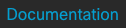
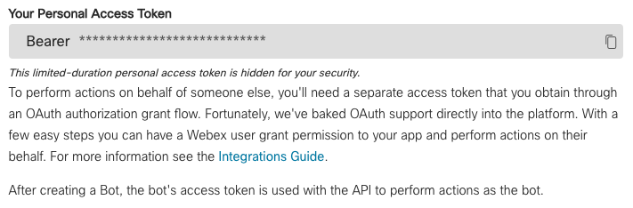

# Python Code to support UCM to Webex Calling migrations

Based on Python 3.8

To use the sample code:
* install Python from [python.org](https://www.python.org)
* create a virtual environment for Python to keep the module dependencies isolated.  
  IMO the most comfortable way to work with Python virtual environments is to use [virtualenvwrapper](https://virtualenvwrapper.readthedocs.io/en/latest/).  
  I'm not sure whether/how that works on Windows.
  A possible fallback is to follow these steps: https://docs.python.org/3/tutorial/venv.html  
* Download all file of this repository to a project directory
* in that project directory install the project requirements with `pip install -r requirements.txt`.  
  If you created and activated a virtual environment before then the project requirements are not installed in the 
  context of your system Python installation but only in the context of your virtual environment  
* rename the file ".env sample" in the project directory to ".env" and in the file edit the required settings: 
  ```
  AXL_HOST=<UCM host to be used for AXL requests>  
  AXL_USER=<username for AXL authentication>  
  AXL_PASSWORD=<password for AXL authentication>  
  WEBEX_ACCESS_TOKEN=<access token obtained from developer.webex.com>  
  GMAIL_ID=<gmail email id user to create dummy email addresses for Webex test users>
  ```
 
To obtain a Webex access token you need to navigate to https://developer.webex.com and log in as an administrator of 
your Webex site.

Then select  in the header and then  at 
the left. This gets you to this:


There you want to copy the access token to your clipboard using the  icon from 
where you can then paste the token to the `.env` file.

For `read_hdpr.py` you have to edit the `read_gdpr.yml` file and enter the host names and credentials of the UCM hosts 
that the tool should read GDPR learned patterns from. The tool creates a CSV file with all patterns learned by any of 
the UCM hosts configured.
